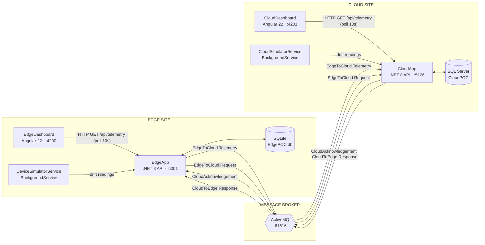
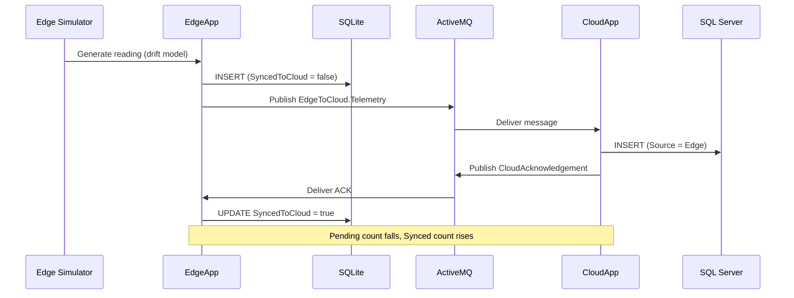

# Cloud ⇄ Edge Telemetry POC — System Architecture

An industrial IoT telemetry simulator. Two sites (Edge + Cloud) exchange sensor data over a message broker. Each site has a .NET API, a database, and an Angular dashboard. The backend generates telemetry continuously; the dashboards only observe.

---

## 1. System Architecture Diagram

## 2. Message-Sync Sequence (the core loop)

## 3. Ports & Infrastructure

| Component | Tech | Port |
|---|---|---|
| CloudDashboard | Angular 22 | 4201 |
| EdgeDashboard | Angular 22 | 4200 |
| CloudApp API | .NET 8 | 5126 |
| EdgeApp API | .NET 8 | 5001 |
| ActiveMQ (OpenWire / console) | Docker | 61616 / 8161 |
| SQL Server | Docker | 1433 |
| SQLite | file | `EdgePOC.db` |

## 4. ActiveMQ Queues

| Queue | Producer | Consumer | Purpose |
|---|---|---|---|
| `EdgeToCloud.Telemetry` | EdgeApp | CloudApp | Push edge readings to cloud |
| `CloudAcknowledgement` | CloudApp | EdgeApp | Confirm receipt → mark synced |
| `EdgeToCloud.Request` | EdgeApp | CloudApp | Ask cloud for its data |
| `CloudToEdge.Response` | CloudApp | EdgeApp | Return cloud data to edge |

---

# Team Split — 4 Owners

## 👤 Person 1 — Frontend / Dashboard (Angular)

**Owns:** both dashboards, charts, live refresh, UX.

- Stack is Angular 22, standalone components, **zoneless** change detection.
- State is held in **signals**; the view reacts when a signal is set.
- The dashboard **polls** `GET /api/telemetry` every 10 seconds. One timer, one request.
- Charts use **ng2-charts** over **Chart.js v4** (line, bar, doughnut).
- KPI numbers animate with a small count-up component. Layout never moves.
- The table is a live log; `trackBy` keeps rows stable and flashes new ones.

**Errors solved on the dashboard:**
- `"line" is not a registered controller` → ng2-charts v10 does **not** auto-register. Fixed by `provideCharts(withDefaultRegisterables())`.
- Cards stuck at 0, view never updated → app is **zoneless** with no scheduler. Fixed by `provideZonelessChangeDetection()` **and** signal-based state.
- Charts blank after data arrived → data was mutated in place with the **same reference**, so ng2-charts never redrew. Fixed by giving each refresh a **new** data object (earlier) / an explicit `chart.update()` (now).
- Charts "jumped" / redrew from scratch every cycle → new data object each poll made the chart **re-animate from baseline**. Fixed by keeping **one stable data object**, mutating its arrays **in place**, and calling `chart.update()` via `@ViewChildren(BaseChartDirective)`. Canvases are permanently mounted, so instances are **never destroyed**.
- Angular template crash → an **arrow function** (`filter(t => ...)`) was written in the template. Fixed by moving it to a `computed()` in the component.
- Stale double render / hydration noise → **SSR** was on. Fixed by switching CloudDashboard to plain client-side (CSR).
- Wrong time windows → backend timestamps are UTC without `Z`. Fixed with a `parseUtc()` helper.

---

## 👤 Person 2 — .NET / Backend (ASP.NET Core)

**Owns:** both Web APIs, controllers, EF Core, DI, CORS.

- Two ASP.NET Core 8 Web APIs: **CloudApp** and **EdgeApp**.
- **EF Core** persists data: SQL Server for cloud, SQLite for edge.
- `TelemetryController` exposes `GET /api/telemetry` and `POST /generate`.
- `db.Database.EnsureCreated()` builds the schema on first run.
- **CORS** allows the dashboard origins (4200, 4201).
- **Swagger** is enabled for manual API testing.
- Services are wired with dependency injection (`AddSingleton`, `AddHostedService`).

**Errors solved in .NET:**
- SQL Server connection failed (`error 40`) → no server for `Trusted_Connection`. Fixed by running SQL Server in Docker and switching the connection string to **SA auth**.
- Host crashed on startup → a `BackgroundService`/consumer threw. Fixed by ensuring the broker + DB are up first, and guarding the loop with try/catch + cancellation.
- Build failed with "file in use" → the running app **locked the DLL**. Fixed by stopping the old process before rebuilding.
- Generation logic was duplicated → extracted into one shared `ITelemetryGenerator`, reused by the controller **and** the simulator.

---

## 👤 Person 3 — Data Ingestion / Simulation

**Owns:** continuous telemetry generation and storage.

- A **`BackgroundService`** runs forever on each side (Edge + Cloud).
- It emits one reading per device every **1–3 seconds** (configurable).
- Values are **not random** — they use a **mean-reverting random walk**.
- Each device keeps its **own state**; the next value starts from the last one.
- Small Gaussian noise = smooth drift. Rare **spikes** = anomalies, then recovery.
- Values are **clamped** to realistic bands (temp, humidity, pressure).
- Every reading is written to the database (SQLite on edge, SQL Server on cloud).
- Edge readings are then handed to the messaging layer for sync.
- All ranges, intervals, and device counts live in `appsettings.json` → **no code change** to tune.
- The dashboard shows a **rolling window** (last 30 samples) so history scrolls.

**Errors solved:**
- Charts looked fake / values jumped 25 → 58 → 20 → replaced random numbers with the **stateful drift model**.
- Cloud series was static → added a **CloudSimulatorService** so cloud data also streams live.

---

## 👤 Person 4 — ActiveMQ / Messaging

**Owns:** the broker and all cross-site message flow.

- **ActiveMQ** is the broker; both APIs connect over **OpenWire (61616)**.
- .NET talks to it via the **Apache.NMS.ActiveMQ** client.
- Communication is **queue-based** and asynchronous (4 named queues).
- **Producer:** `ActiveMQService.PublishMessage(queue, json)`.
- **Consumer:** a `BackgroundService` subscribes with a message `Listener`.
- Payloads are JSON (Newtonsoft) of the `Telemetry` model.
- **Flow:** Edge publishes telemetry → Cloud stores it → Cloud sends an **ACK** → Edge marks the row **synced**.
- This makes **Pending Sync** fall and **Synced to Cloud** rise naturally.
- A second flow (`Request` / `Response`) lets Edge pull cloud data on demand.

**Errors solved:**
- `Error connecting to localhost:61616` → **no broker running**. Fixed by starting ActiveMQ in Docker.
- App died when the broker was down → the consumer threw at startup. Fixed by starting the broker before the apps and handling connection failure gracefully.

---

## 5. How to Run

1. **Infra:** `docker start activemq sqlserver` (or `docker run` first time).
2. **APIs:** `dotnet run` in `CloudApp` (:5126) and `EdgeApp` (:5001).
3. **Dashboards:** `npm start -- --port 4201` in `CloudDashboard`, `npm start` in `EdgeDashboard` (:4200).
4. Open **http://localhost:4201** (Cloud) and **http://localhost:4200** (Edge). Data flows automatically — no clicks needed.

**Config knobs:** backend → `appsettings.json → Simulation`; frontend → `src/app/dashboard.config.ts`.
